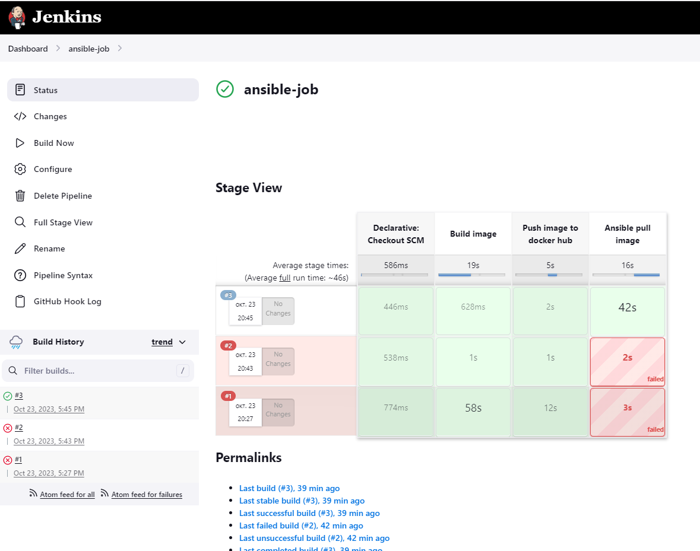

# CI CD Project


## Launching instances

Using Terraform code launch EC2:

Then start the creating process

```
terraform init
terraform apply
```

## Host server configuration (with Jenkins)

First, add add permissions to docker socket (read and write for all)

```
sudo chmod a=rw /var/run/docker.sock
```

Next goto `http://your-host-server-ip:8080/`

For registration, you need to unlock Jenkins using the initial administrator password

```
sudo docker exec jenkins cat /var/jenkins_home/secrets/initialAdminPassword
```

Set english language as default (optional)

- Manage Jenkins >> Manage Plugins >> Available plugins


- Manage Jenkins >> Configure System


Install docker pipeline


Install ansible plugin to jenkins

- Manage Jenkins >> Manage Plugins >> Available plugins


Need to download ansible to jenkins container

```
docker exec -it --user root jenkins bash

apt-get update

apt-get install -y ansible

Geographic area: 8

Time zone: 24
```

Create hosts file in ansible folder (need for connecting to machine where will target project)

```
cd /etc

mkdir ansible

cd ansible

nano hosts
```

- in 'hosts' file set ip of target server

```
[webserver]
54.156.166.0
```

Add credentials for ssh connection with machine

- Manage Jenkins >> Manage Credentials >> Available plugins


- create ssh credentials


Add docker hub credentials


Add ansible tools for generate pipeline code

- Manage Jenkins >> Global Tool Configuration


Add github webhook

- configure jenkins API Token


- add webhook in github


Add pipeline job with ansible

- create new job


- add triggers


- pipeline code


Save job and run it, then the job will start itself after the push to github




### If job won't working, try execute this code in target machine

```
sudo docker exec mysql-server-container mysql -u root --password=31xLobOJO4fFUKE62oOFA8ev1jhFRq -e "create database devops_finaltask_db;"
```


